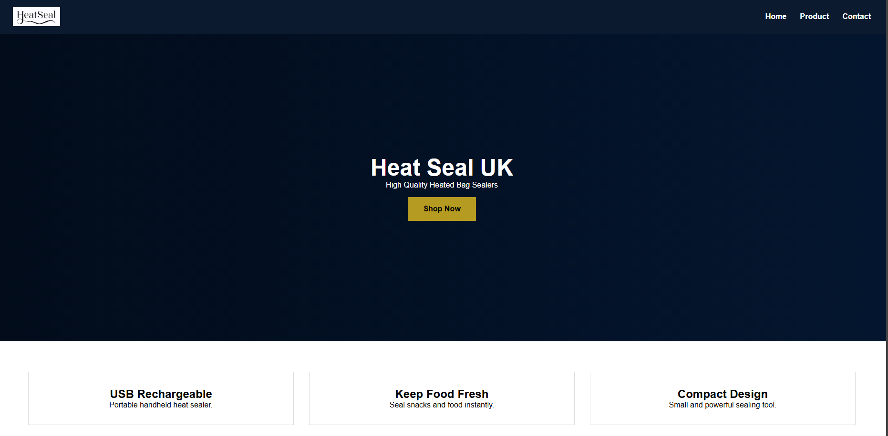

# E-Commerce Website (HTML & CSS)

## Project Overview
This project is a static e-commerce website created using HTML5 and CSS called Heat Seal UK.
It demonstrates page structure, navigation, layout, and responsive design and is built like a shopify store to be able to sell a product.
No JavaScript was used.

## Website Pages
- Home page
- Services page
- Contact page

## Technologies Used
- HTML5
- CSS3
- GitHub Pages

## Live Website
(https://hvars16.github.io/Heat-Seal-UK/index.html)

## Screenshots

## Author

Haren Varsani – CST0400 – 2025/26
